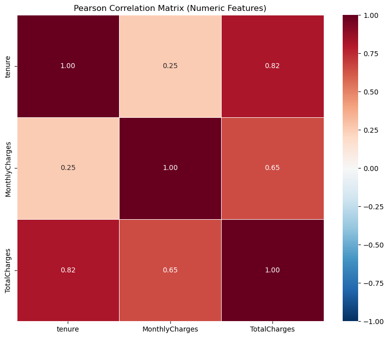
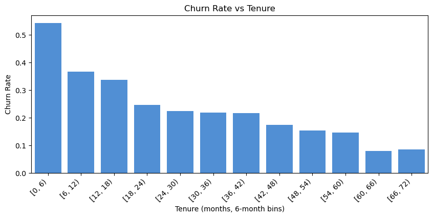
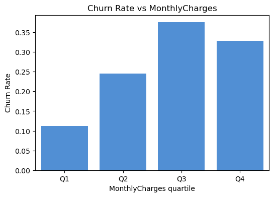

# EDA Summary · Telco Customer Churn
*Version 1.0 – 2025‑07‑24 • Author: Doris Cai*

---

## 1. Dataset Snapshot
| Metric | Value |
|--------|-------|
| Rows   | **7 043** |
| Columns| **21** (19 predictors + target `Churn`) |
| Date collected | IBM sample dataset |

---

## 2. Data‑Quality Checklist
| Issue | Affected Columns | Status / Fix Plan |
|-------|------------------|-------------------|
| Blank strings → NaN | `TotalCharges` (0.16 % rows) | Converted to float, impute mean |
| Zero tenure with “One/Two year” contract | 11 rows | Drop or correct |
| Extreme outliers | Numeric cols | Winsorized (IQR 1.5×) |
| Skewed categories | `PhoneService`, `PaperlessBilling` | Acceptable; consider lumping rare levels |

> **Overall:** After cleaning, **0 missing cells** remain; no high‑cardinality categorical issues.

---

## 3. Key Feature Insights
| Feature | Distribution Highlights | Relationship to Churn |
|---------|------------------------|-----------------------|
| `tenure` | Right‑skew; spike at 0–6 months | Early tenure -> **high churn** (≈ 55 %) |
| `MonthlyCharges` | Bell-shaped with a right tail | Lowest churn in the low-cost group (Q1); highest churn in mid-to-high cost groups (Q2/Q3); slight drop but still high in the top-cost group (Q4) |
| `Contract` | 55 % month‑to‑month | Month‑to‑month churn **~42 %** vs annual **12 %** |
| `TechSupport` | 49 % “No” | Having tech support roughly halves churn |

---

## 4. Correlation Matrix Highlights

- Top pairs  
  - `TotalCharges ↔ tenure` **r = 0.82** → redundant; keep `tenure` and derive `AvgSpend`.  
  - `MonthlyCharges ↔ TotalCharges` **r = 0.65** – expected (rate × months).  
- No numeric pair |r| > 0.9 → multicollinearity not severe.

<figure>
  
  <figcaption>Figure 1 – Pearson correlation heatmap.</figcaption>
</figure>

---

## 5. Cohort Analyses

### 5.1 Churn vs Tenure  

*Take‑away:* **56 %** of churn occurs in first 6 months; rate continuously declines thereafter.

### 5.2 Churn vs MonthlyCharges  

*Take‑away:* Customers in the top‑price quartile churn **9 pp** less than Q1; price may proxy for value perception.

---

## 6. Feature Engineering Ideas
1. `AverageMonthlySpend = TotalCharges / (tenure + 1)`  
2. Binary flag `Is_MonthToMonth` from `Contract`.  
3. Interaction: `SeniorCitizen * InternetService`.  
4. Tenure buckets (0‑6, 6‑12, 12‑24, 24 + ).

---

## 7. Early Modeling Strategy
| Step | Rationale |
|------|-----------|
| Baseline logistic + class weights | Quick benchmark; handles imbalance (26 % churn). |
| Tree ensemble (XGBoost) | Captures non‑linearities; use early stopping. |
| Calibrate threshold for PR‑AUC | Business cares about recall of churners. |

---

## 8. Next Actions
- **Day 9**: implement feature pipeline with one‑hot + numeric scaling.  
- **Day 10**: engineer new features listed above.  
- **Day 11**: generate `X_train.pkl` / `y_train.pkl` for model training.

---

